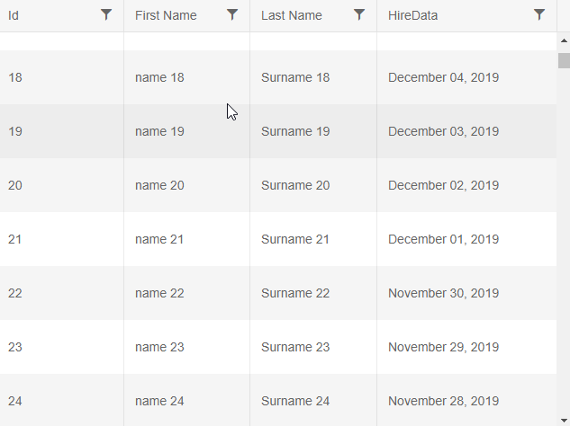

# Virtual Scrolling

Virtual scrolling is an alternative to paging. Instead of using a pager, the user scrolls vertically through all records in the data source.

The same set of elements is reused to improve performance. While the next data is loading, a loading indicator is shown on the cells. If the user scrolls back up after scrolling down to a next page, the previous page will be loaded anew from the data source, like with regular paging.

## Requirements

To enable virtual scrolling:

1. Set `ScrollMode="@GridScrollMode.Virtual"` - this enables the virtualization of items
2. Provide  `Height`, `RowHeight`, and `PageSize` to the grid - this lets the grid calculate the position of the user in order to fetch the correct set of items from the data source.

>caption Sample of virtual scrolling in the Telerik Grid for Blazor

````CSHTML
@* Scroll the grid instead of paging *@

<TelerikGrid Data=@GridData
             ScrollMode="@GridScrollMode.Virtual"
             Height="400px" RowHeight="40" PageSize="20"
             Sortable="true" FilterMode="@GridFilterMode.FilterMenu">
    <GridColumns>
        <GridColumn Field="Id" />
        <GridColumn Field="Name" Title="First Name" />
        <GridColumn Field="LastName" Title="Last Name" />
        <GridColumn Field="HireData">
            <Template>
                @((context as SampleData).HireDate.ToString("MMMM dd, yyyy"))
            </Template>
        </GridColumn>
    </GridColumns>
</TelerikGrid>

@code {
    public List<SampleData> GridData { get; set; }

    protected override async Task OnInitializedAsync()
    {
        GridData = await GetData();
    }

    private async Task<List<SampleData>> GetData()
    {
        return Enumerable.Range(1, 1000).Select(x => new SampleData
        {
            Id = x,
            Name = $"name {x}",
            LastName = $"Surname {x}",
            HireDate = DateTime.Now.Date.AddDays(-x)
        }).ToList();
    }

    public class SampleData
    {
        public int Id { get; set; }
        public string Name { get; set; }
        public string LastName { get; set; }
        public DateTime HireDate { get; set; }
    }
}
````

>caption How virtual scrolling looks like (deliberately slowed down to showcase the loading signs)



## Notes

There are several things to keep in mind when using virtual scrolling:

* The `RowHeight` is a decimal value that is always considered as pixel values. If you use [row emplate](#row-template), make sure it matches the `RowHeight`. The `Height` does not have to be in pixels, but it may help you calculate the `PageSize` (see below).
    * If the row/cell height the browser would render is larger than the `RowHeight` value, the browser will ignore it. It can depend on the chosen Theme or other CSS rules, or on cell data that falls on more than one row. Inspect the rendered HTML to make sure the grid setting matches the rendering.
* Do not mix virtualization with paging, as they are alternatives to the same feature.
* Provide for a `PageSize` of the Grid that is large enough, so that the loaded table rows do not fit in the scrollable data area, otherwise the vertical virtual scrollbar will not be created and scrolling will not work. To do this, take into account the `Height` of the grid and the `RowHeight`.
    * The `Data` of the grid must contain more items than the `PageSize` in order for the virtual scrolling feature to work.
* You can control how many rows are rendered through the `PageSize`. If performance does not suit your needs, tweak mostly that property (for example, if latency is high - fetch larger chunks of data so that a remote service is called less often; or when the browser is responding slowly, decrease the page size to render fewer DOM elements).
* When using the [`OnRead` event](), use the `PageSize` and `Skip` parameters to know what data to return, instead of `PageSize` and `Page` as with regular paging.
* Horizontal scrolling is not virtualized, all columns are rendered.


## Limitations

Virtualization is mainly a technique for improving client-side performance and the user experience. Its cost is that some features of the grid do not work with it. An alternative to that is to use [regular paging]() with [mantual data source operations]() to implement the desired performance of the data retrieval.

List of the known limitations of the virtual scrolling feature:

* [Hierarchy]() is not supported.
* [Grouping]() is not supported.
* [Multiple Selection]() is not fully supported. Selecting all items from the header checkbox can select only the currently rendered page of records.

## See Also

  * [Live Demo: Grid Virtual Scrolling](https://demos.telerik.com/blazor-ui/grid/virtual-scrolling)
   
